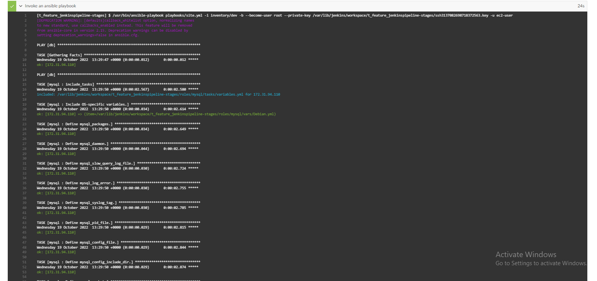
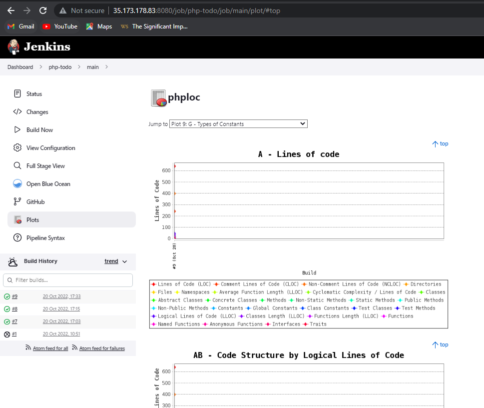

# IMPLEMENTATION OF PROJECT 14

**EXPERIENCE CONTINUOUS INTEGRATION WITH JENKINS | ANSIBLE | ARTIFACTORY | SONARQUBE | PHP**
--
Before we delve into the most interestng part of tihs project,it is pertinent we take a look at the key concepts specially relevant to the implementation of the project. Some of the processes will be skipped due to an assumption that there is a clear understanding since we have been clearly ecplicit in the implementation of prior project. Moreover, it is just about to get interesting! To have a full grasp of how interesting DevOps is, i stongly recommend you enrol at [Darey.io](https://www.darey.io/) as all the codes won't be added here. This project will be in different phases. The first phase is theoretical while other phases are completely practical. Without further ado, let's get started!
## Theoretical Phase
----
Definition of Key Concepts
- Continuous Integration
- Jenkins
- Ansible
- Artifactory
- SonarQube
- PHP

What is Continuous Integration?

 It is a DevOps software development practice where developers regularly merge their code changes into a central repository, after which automated builds and tests are run. Continuous integration most often refers to the build or integration stage of the software release process and entails both an automation component (e.g. a CI or build service) and a cultural component (e.g. learning to integrate frequently). The key goals of continuous integration are to find and address bugs quicker, improve software quality, and reduce the time it takes to validate and release new software updates.

- Why is Continuous Integration Needed?
In the past, developers on a team might work in isolation for an extended period of time and only merge their changes to the master branch once their work was completed. This made merging code changes difficult and time-consuming, and also resulted in bugs accumulating for a long time without correction. These factors made it harder to deliver updates to customers quickly.

**How does Continuous Integration Work?**
- With continuous integration, developers frequently commit to a shared repository using a version control system such as Git. Prior to each commit, developers may choose to run local unit tests on their code as an extra verification layer before integrating. A continuous integration service automatically builds and runs unit tests on the new code changes to immediately surface any errors. Read more [here](https://aws.amazon.com/devops/continuous-integration/)

- JENKINS

Jenkins is an open source automation server. It helps automate the parts of software development related to building, testing, and deploying, facilitating continuous integration and continuous delivery. It is a server-based system that runs in servlet containers such as Apache Tomcat. It supports version control tools, including AccuRev, CVS, Subversion, Git, Mercurial, Perforce, ClearCase and RTC, and can execute Apache Ant, Apache Maven and sbt based projects as well as arbitrary shell scripts and Windows batch commands. Read more about it [here](https://en.wikipedia.org/wiki/Jenkins_(software))

- ANSIBLE

Ansible® is an open source, command-line IT automation software application written in Python. It can configure systems, deploy software, and orchestrate advanced workflows to support application deployment, system updates, and more.

Ansible’s main strengths are simplicity and ease of use. It also has a strong focus on security and reliability, featuring minimal moving parts. It uses OpenSSH for transport (with other transports and pull modes as alternatives), and uses a human-readable language that is designed for getting started quickly without a lot of training. Read how it works [here](https://www.ansible.com/overview/how-ansible-works)

- ARTIFACTORY

Artifactory is a branded term to refer to a repository manager that organizes all of your binary resources. These resources can include remote artifacts, proprietary libraries, and other third-party resources. A repository manager pulls all of these resources into a single location. The word “Artifactory” refers to the JFrog product, the JFrog Artifactory, but there are several other package managers out there such as Packagecloud. 

                
Artifactory, and package managers at large, support build integration whether you are using one of the popular CI servers, building standalone without a CI server, or if you’re using a cloud-based CI server. Package managers can handle all dependencies and/or a build's artifacts as a single unit for bulk actions like exporting, moving, and copying. Read  more [here](https://blog.packagecloud.io/what-is-artifactory/#:~:text=Artifactory%20is%20a%20branded%20term,resources%20into%20a%20single%20location.)

- SonarQube

SonarQube is an open-source platform developed by SonarSource for continuous inspection of code quality to perform automatic reviews with static analysis of code to detect bugs, code smells on 29 programming languages. Read more [here](https://en.wikipedia.org/wiki/SonarQube)

- PHP

Hypertext Preprocessor (PHP) is an open-source, free server-side scripting language widely used in web development. According to Web Technology Surveys, PHP is used by 78.1% of all websites, including high-traffic websites like Facebook and Wikipedia. 

Anyone can benefit from learning about PHP, but it is even more essential for those interested in web programming. PHP is available on all major operating systems, such as Linux, Microsoft Windows, and macOS. Most web servers, including Apache and IIS, also support PHP. 

One of the main benefits of using PHP is advancing the customization of a WordPress site. Other features include great online support and documentation, so even beginners can learn PHP quickly. 

# PRACTICAL PHASE
The first task was to update my repo with particular modifications to the Inventory folder to now include the following files (ci, dev, uat, sit amonngst others). Inside the ci file, i updated it respectively with jenkins, nginx, sonarqube and artifactory Private IP addresses. i did updated other sub files inisde the inventory folder with the required information. 

**Configuring Ansible For Jenkins Deployment**
-
In previous projects, we have been launching Ansible commands manually from a CLI. Now, with Jenkins, we will start running Ansible from Jenkins UI. To do this, navigate to Jenkins URL, install & Open Blue Ocean Jenkins Plugin and Create a new pipeline. What i did was to first install jenkins, java and some relevant dependencies in other to avoid failure while running the ansible playbooks command. I confirmed jenkins was running , see the image below

Afer installing jenkins, i logged in and installed blue ocean, opened it, connected my github repository to it using the PAT, and configure it accordingly. I opened the terminal, created a new directory and named it `deploy` and created a file inside it with the name `Jenkinsfile`. I updated the jenkinsfile with a task. I configured the ansible project in other to run a pipeline job for the jenkinsfile and this gave me the output accessed though blue ocean. Check the image below:

After this, i created and swithed to a new branch and named it *feature/jenkinspipeline-stages*  so i could add and commit the new changes directly to the new branch and this appeared on jenkins homepage. Check the imkage below: 

. After this, i updated the task in the `jenkinsfile` to now build and test, then i pushed and committed it on the new branch. The build was successful and the image below was the output.

I created a pull request and merged the changes on the new branch to that on the main branch and the merge was successful. After this, i updated the `jenkinsfile` to include a dummy task to clean the workspace, build, test, package and deploy. I committed and committed the changes on the feature/jenkkins branch and the picture below was the output

- After this, i merged the updated `jenkinsfile` on the main branch and the below image was equally the output.  installed ansible plugin on jenkins I instaalled ansible after this with `sudo yum install ansible -y` and the image below was the output: 
- I created two new instances for nginx and jenkins respectively. I deleted the dummy taks in the `jenkinsfile` to perform a better task (I updated the jenkinsfile to perform this task) after adding the `ansible.cfg` file inside the `deploy folder`.  I updated my `site.yml`,since i play to run the ansible playbook command against the dev enviroment, so i added the private Ips of jenkins and nginx accordingly, updated the mysql role and I committed and pushed the new changes on the feature/jenkins branch to run ansible from jenkins and the images below was the output:
   

In other to easily run against the `ci` environment, i updated the `jenkinsfile` to include parameters and i referenced the inventory to include playbook execution stage. I committed and pushed to github. The image below was the output. 
After this, i merged the changes on the main branch and the image below was the output. 
- I forked a repo named `phpp-todo` from [darey.io](https://github.com/darey-devops/php-todo.git) and cloned it down to my virtual workspace. I opened a new terminal for `php-todo` and installed php and composer and ensured it was active and running. see the images below:  

- I installed plots and artifactory plugin directly on jenkins successfully. I launched a new instance for artifactory and updated the private IP address in the `inventory/ci` file, configured the artifactory role, and updated the tasks and edited the `site.yml`, added a new yml file in the static-assisgnments folder, committed and pushed the changes directly to the main branch. I updated the `jenkinsfile` to chnage the branch and ensured the ansible playbook runs against the `ci` environment. The build was successful and the deployment was done effortlessly. see the image below: 
To confirm if artifactory was successfully deployed, i tried accessing it with the artifactory public ip on port `8082` and the images below were the output.   
    I configured the artifactory on jenkins page thereafter. 

- Inside the php-todo folder, i addded a new file and named it `jenkisfile` updated it with dummy tasks. In the process, i edited the `ansible-config-mgt/roles/mysql` role, added the mysql private ip address, created a new database and named it (homestead, set the password and also edited the `site.yml` to include `db.yml` inside the `static-assignments`   committed and pushed the changes tomain branch on gtihub. The build was successful. See the images below.  
- This was confirmed on the mysql terminal and the image below was the output.  
On the `php-todo` folder, i committed and pushed the newly added  `jenkinsfile`  so the change could be effected.  See the image below

- The new php-todo repository was added on blue ocean and it was successful. On the `php-todo/jenkinsfile` i updated ut and included more codes for phploc and plots and it was successful. Check the images below.  
- I updated the `php-todo/jenkinsfile` to public the resulted artifact into artifactory, created a todo server, updated my dev enviroment, and `site.yml`, committed and pushed the changes to github.

- I launched a new instance for SonarQube, configured it, updated necessary roles, folders and files in other for it to work and i deployed it after committing and pushing the changes. The images below as the output:
 [Sonarqube install 2](./images/SonarQube%20installation%202.PNG) . I accessed it through the browser with its public Ip address on Port 9000 and it was successful. Check the image below. 
- I installed the *SonarScanner Plugin On Jenkins and configured it accordingly. On the SonarQube webpage, i configured the webhooks, filled in the relevant details. I updated the jenkinsfile by adding new job to include SonarQube Scanner and SonaQube Quality gate. See the image below after pushing my changes to guthub: 

I  updated the `jenkinsfile` to excute units tests. 
I created a new branch on the php-todo repository so it could pause SonarQube due to the excessive bugs and threats, code smells which prevented the code from pushing beyond the SonarQube stage. The image below was the ouptut. 

I introduced jenkins slave by creating a new instance, i installed java on the server, configured it on jenkins then i connected my jenkins server to my php-todo repository and the connection was successful. See hthe image below:

This brings us to the end of Project 14!

Thank you!